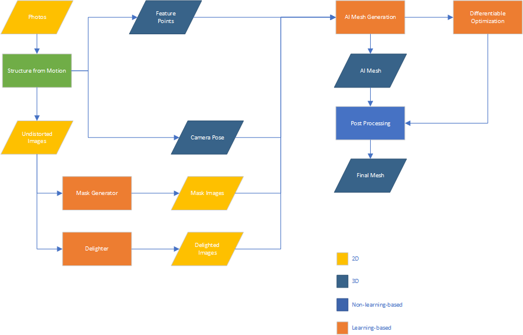

# Data Flow in AIHoloImager

This is the overall data flow graph.

1. Input Images and Structure from Motion (SfM) Module:
    * The journey begins with input images, which are fed into the **Structure from Motion** module (implemented using [openMVG](https://github.com/openMVG/openMVG)). This module performs several critical tasks:
      * Generates a point cloud representing the scene.
      * Determines camera poses for each image.
      * Produces undistorted versions of the input images.
    * Additionally, a **Mask Generator** (implemented with [rembg](https://github.com/danielgatis/rembg)) processes the undistorted images, effectively separating foreground objects from the background.

2. Reconstruct Mesh Module:
    * All the processed data--point cloud, camera poses, undistorted images, and mask images--is sent to the **Reconstruct Mesh** module (implemented using [openMVS](https://github.com/cdcseacave/openMVS)). Here, an initial 3D mesh is generated.

3. Multi-view Renderer and Multi-view Diffusion:
    * The initial mesh serves as input for the **Multi-view Renderer** module. This module:
      * Creates an image from the initial view.
      * Generates six additional images from different views.
    * The image form the initial view is then passed to the **Multi-view Diffusion** module (implemented using [zero123plus](https://github.com/SUDO-AI-3D/zero123plus)). It synthesizes images from 6 views, which are blended with the ones produced by the renderer.

4. AI Mesh Generator:
    * The 6 images are further processed by the **AI Mesh Generator** module (implemented using [InstantMesh](https://github.com/TencentARC/InstantMesh)). This AI-powered step refines the 3D mesh, enhancing its completeness.

5. Post Processing:
    * Finally, in the **Post Processing** module:
      * Project the texture to the 3D mesh.
      * Transform the mesh to a suitable pose.

In summary, AIHoloImager combines traditional and AI-driven techniques to reconstruct a comprehensive 3D mesh from a limited set of input photos.
